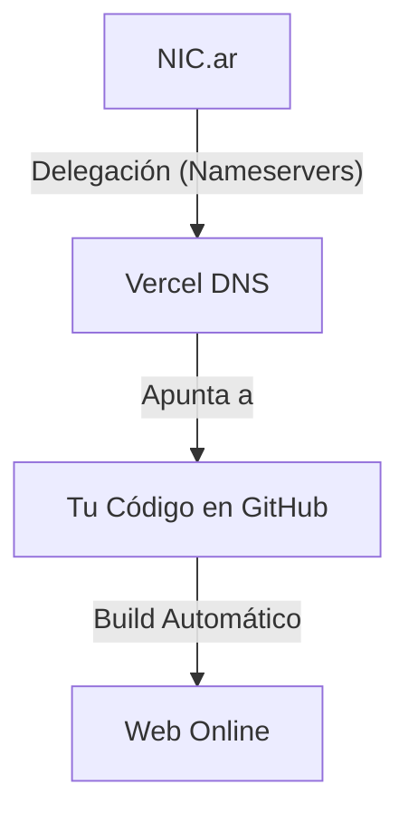

# 02 - Configuración y Despliegue

Este es el proceso técnico que conecta tu nombre de dominio con los servidores donde vive tu web.

## 1. Esquema de Conexión

## 2. Pasos para Activar un Dominio

Si decides registrar un nuevo dominio en el futuro:

1.  **Registrar en NIC.ar**: Compras el `.ar` o `.com.ar`.
2.  **Configurar en Vercel**: En el panel de tu proyecto, vas a *Settings > Domains* y agregas el nombre.
3.  **Delegar en NIC.ar**: Vercel te dará dos "Nameservers" (ej: `ns1.vercel-dns.com`). Debes pegarlos en el panel de control de NIC.ar dentro de la sección "Delegar".
4.  **Esperar**: La "propagación" puede tardar desde 5 minutos hasta 24 horas.

## 3. El Rol de GitHub

Tú no subes archivos manualmente a un servidor (FTP). Tú subes archivos a **GitHub**.
- **Vercel** vigila tu repositorio de GitHub. 
- Al detectar un cambio (un nuevo artículo o foto), Vercel descarga el código, lo compila y lo publica.

> [!IMPORTANT]
> **No toques NIC.ar una vez configurado.** Toda la magia ocurre entre tu PC, GitHub y Vercel.
